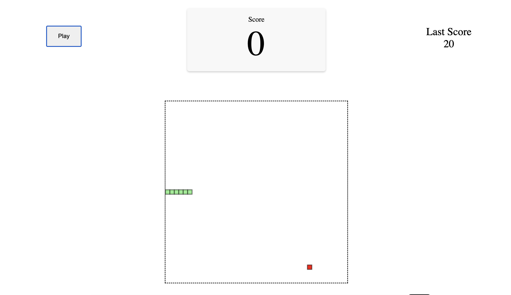

# Snake Game

A classic implementation of the Snake game using web technologies, where players control a snake to collect food, increase their score, and avoid collisions.

---

## Features ✨

- **Dynamic Gameplay**: The snake grows with each food item consumed.
- **Score Tracking**: Keep track of your high scores.
- **Random Food Placement**: Food items appear randomly on the game canvas.
- **Canvas Rendering**: Smooth graphics using HTML5 Canvas.
- **Keyboard Controls**: Navigate the snake using arrow keys.

---

## Setup Instructions 📁

1. Clone the repository:
   ```bash
   git clone https://github.com/Pra8al/Snakegame.git
   ```

2. Navigate to the project directory:
   ```bash
   cd Snakegame
   ```

3. Open the `index.html` file in a web browser to start the game.

---

## How to Play 🎮

1. Use the **arrow keys** to control the snake's direction:
   - **Up Arrow**: Move Up
   - **Down Arrow**: Move Down
   - **Left Arrow**: Move Left
   - **Right Arrow**: Move Right

2. Eat the food to gain points and grow the snake.

3. Avoid colliding with the walls or yourself to keep playing.

---

## Screenshots 📷

Screenshots of game:

**Gameplay**:
   

---

## Acknowledgments 🙏

Inspired by the classic Snake game to demonstrate the power of JavaScript and HTML5 Canvas.
